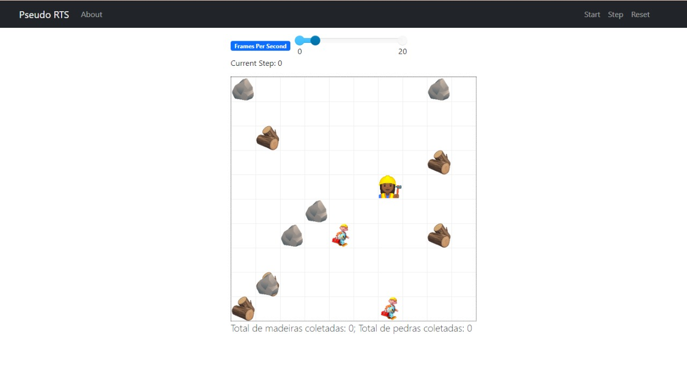

# Pseudo RTS

**Disciplina**: FGA0210 - PARADIGMAS DE PROGRAMAÇÃO - T01 <br>
**Nro do Grupo**: 02<br>
**Paradigma**: SMA<br>

## Alunos
| Matrícula | Aluno                                                               |
| --------- | ------------------------------------------------------------------- |
| 180119818 | [Felipe Boccardi Silva Agustini](http://github.com/fealps)          |
| 180052845 | [Gabriela da Gama Pivetta](http://github.com/gabrielapivetta)       |
| 180017659 | [Giovana Vitor Dionisio Santana](http://github.com/giovanadionisio) |
| 170011267 | [Giovanna Borges Bottino](http://github.com/giovannabbottino)       |
| 180017870 | [Giulia Lobo Barros](http://github.com/Giuulob89)                   |
| 170144488 | [Henrique Amorim Costa Melo](http://github.com/henriqueamorim20)    |
| 180018574 | [Hérya Rodrigues Alcantara](http://github.com/hryds)                |
| 180025601 | [Murilo Gomes de Souza](http://github.com/murilogds)                |

## Sobre 
<<OBS: Não especificado no Prazo - Profa. Milene>>
Descreva o seu projeto em linhas gerais. 
Use referências, links, que permitam conhecer um pouco mais sobre o projeto.

## Screenshots
Apresentados na seção [**Uso**](https://github.com/UnBParadigmas2022-1/2022.1_G2_SMA_PseudoRTS#uso)

## Instalação 
**Linguagens**: Python a partir da versão 3.7<br>
**Tecnologias**: Mesa<br>

### Crie um ambiente em python 3
```
python3 -m venv env
```

### Ative o ambiente
```
source env/bin/activate
```

### Instale as dependencias
```
pip install -r requirements.txt
```

### Rode o programa
Dentro da pasta ```src``` execute o comando
```
python __init__.py
```

## Uso 
Para usar o projeto é simples! Depois que forem feitos os passos listados no tópico acima basta clicar em start na pagina q foi aberta no navegador 



## Vídeo
[Apresentação](https://unbbr-my.sharepoint.com/:v:/g/personal/180119818_aluno_unb_br/Ecr17EKpv5hMkgfKv6TzW3ABlDzKTlYlun7pxg5OAwrscA?e=gnqJee)

## Participações
Apresente, brevemente, como cada membro do grupo contribuiu para o projeto.
|           Nome do Membro             | Contribuição | Significância da Contribuição para o Projeto (Excelente/Boa/Regular/Ruim/Nula) |
| ------------------------------------ | ---------------------------------- | ---------- |
|   Felipe Boccardi Silva Agustini     | Agente Construtor                  | Execelente |
|   Gabriela da Gama Pivetta           | Agente Mapa                        | Execelente |
|   Giovana Vitor Dionisio Santana     | Interface                          | Execelente |
|   Giovanna Borges Bottino            | Agente Construtor                  | Execelente |
|   Giulia Lobo Barros                 | Agente Coletor                     | Execelente |
|   Henrique Amorim Costa Melo         | -                                  |    Nula    |
|   Hérya Rodrigues Alcantara          | Interface                          | Execelente |
|   Murilo Gomes de Souza              | Agente Coletor & Agente Mapa       | Execelente |

## Outros 

### I. Lições Aprendidas

O paradigma multiagentes trouxe uma visão diferente da programação convencional, e sua abstração não foi uma tarefa trivial no contexto que propomos, criar uma Jogo de estratégia em tempo real, pois tivemso que lidar com limitação da nossas ferramentas e conhecimentos, abrindo mão da existencia de um "Jogador" para tranformar o jogo em uma simulação de coleta de recursos e construção de cidades. E nossa falta de conhecimento se provou um empecilho quando trabalhando com mesa, já que não conseguimos usar todo o potencial da ferramenta o que se mostra na nossa tentativa de ao tentar criar um codigo mais voltado a comportamento acabamos em um sistema mais voltado a orientação a objetos.
### II. Percepções
Percebemos que os vicios de OO são muito fortes e quando trabalhamos com uma linguagem mais maleável nós nos recorremos a algo conhecido para solucionar problema obtidos. Apesar disso, no nosso uso de SMA foi possivel perceber que o paradigma é bom para simulações e entedimento de contextos.
### III. Contribuições e Fragilidades
As fragilidades do projeto podem ser vistas principalmente se houver mais de um coletor, pois como eles possuem um mesmo comportamento, os agentes tentam coletar o mesmo recurso, Além disso o codigo possui um viés muito forte no paradigma de orientação a objetos, o que gostariamos de ter evitado mais.
### IV. Trabalhos Futuros

Uma evolução possivel do trabalho é melhorar a parte comportamental dos agentes e a criação de um agente Jogador, onde seria possivel instruir aos coletores o que eles deveriam coletar e aos coletores oque deveriam construir, além disso seria necessário fazer com que os recursos disponiveis no mapa fossem gerados novamente quando os existentes se esgotassem.

## Fontes
 * Documentação do MESA: https://mesa.readthedocs.io/en/latest/
